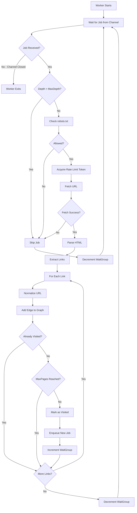

# Concurrent Web Crawler

A high-performance, production-ready web crawler built in Go that features concurrent processing, rate limiting, robots.txt compliance, and crawl graph generation.

## Table of Contents

- [Overview](#overview)
- [Features](#features)
- [Architecture](#architecture)
- [Project Structure](#project-structure)
- [Installation](#installation)
- [Usage](#usage)
- [Configuration Options](#configuration-options)
- [Components](#components)
- [Flow Diagrams](#flow-diagrams)
- [Output](#output)
- [Examples](#examples)
- [Technical Details](#technical-details)

## Overview

This concurrent web crawler is designed to efficiently crawl websites while respecting server resources and following web standards. It uses Go's concurrency primitives (goroutines and channels) to achieve high performance while maintaining control over request rates and resource usage.

The crawler builds a directed graph of the crawled pages, tracking which pages link to which, and can export this graph in DOT format for visualization using Graphviz.

## Features

### Core Features

- **Concurrent Processing**: Multiple worker goroutines process URLs simultaneously
- **Rate Limiting**: Global rate limiter ensures compliance with server load limits
- **Depth Control**: Configurable maximum crawl depth to control scope
- **Page Limits**: Safety limit on maximum pages to crawl
- **Same-Domain Restriction**: Optional constraint to stay within the starting domain
- **robots.txt Compliance**: Respects robots.txt rules for ethical crawling

### Advanced Features

- **Crawl Graph Generation**: Builds and exports a directed graph of page relationships
- **Real-time Progress Logging**: Live statistics during crawl execution
- **Duplicate Detection**: Thread-safe visited URL tracking prevents re-crawling
- **Configurable Timeouts**: HTTP request timeout controls
- **Custom User-Agent**: Configurable user agent string for identification
- **Depth Statistics**: Tracks and reports pages crawled at each depth level

### Output Features

- **DOT Format Export**: Graph export compatible with Graphviz
- **Detailed Statistics**: Comprehensive crawl metrics and timing
- **Progress Monitoring**: Per-second status updates during execution

## Architecture

The crawler follows a worker pool pattern with the following key architectural components:

```
┌─────────────────────────────────────────────────────────────┐
│                         Main Process                         │
│  ┌─────────────┐  ┌──────────────┐  ┌──────────────────┐  │
│  │ CLI Parser  │→ │ Config Setup │→ │ Crawler Init     │  │
│  └─────────────┘  └──────────────┘  └──────────────────┘  │
└────────────────────────────────┬────────────────────────────┘
                                 │
┌────────────────────────────────▼────────────────────────────┐
│                      Crawler Orchestrator                    │
│  ┌──────────────┐  ┌──────────────┐  ┌─────────────────┐  │
│  │ Job Channel  │  │ Visited Store│  │  Rate Limiter   │  │
│  │  (buffered)  │  │ (thread-safe)│  │   (global)      │  │
│  └──────┬───────┘  └──────┬───────┘  └────────┬────────┘  │
│         │                  │                    │            │
│  ┌──────▼──────────────────▼────────────────────▼────────┐ │
│  │              Worker Pool (N goroutines)               │ │
│  │  ┌────────┐  ┌────────┐  ┌────────┐  ┌────────┐     │ │
│  │  │Worker 1│  │Worker 2│  │Worker 3│  │Worker N│     │ │
│  │  └───┬────┘  └───┬────┘  └───┬────┘  └───┬────┘     │ │
│  └──────┼───────────┼───────────┼───────────┼──────────┘ │
└─────────┼───────────┼───────────┼───────────┼────────────┘
          │           │           │           │
          ▼           ▼           ▼           ▼
    ┌──────────┐┌──────────┐┌──────────┐┌──────────┐
    │ Fetcher  ││ Parser   ││ Robots   ││  Graph   │
    │          ││          ││ Checker  ││ Builder  │
    └──────────┘└──────────┘└──────────┘└──────────┘
```

### Design Patterns

1. **Worker Pool Pattern**: Fixed number of workers consume from a shared job queue
2. **Producer-Consumer**: Workers both consume jobs and produce new jobs
3. **Thread-Safe State**: Mutex-protected shared state for visited URLs and graph
4. **Rate Limiting**: Token bucket pattern for controlling request rate
5. **Graceful Shutdown**: WaitGroup ensures all work completes before exit

## Project Structure

```
concurrent-web-crawler/
├── cmd/
│   └── crawler/
│       └── main.go                 # Entry point and CLI interface
├── internal/
│   ├── config/
│   │   └── config.go              # Configuration structures and defaults
│   ├── crawler/
│   │   ├── crawler.go             # Main crawler orchestrator
│   │   ├── worker.go              # Worker implementation
│   │   ├── visited.go             # Thread-safe visited URL tracking
│   │   ├── ratelimiter.go         # Global rate limiting
│   │   ├── robots.go              # robots.txt compliance
│   │   ├── graph.go               # Crawl graph data structure
│   │   ├── graph_export.go        # DOT format export
│   │   └── WaitGroup.go           # WaitGroup wrapper
│   ├── fetcher/
│   │   └── fetcher.go             # HTTP fetching logic
│   └── parser/
│       └── links.go               # HTML parsing and link extraction
├── go.mod                          # Module dependencies
├── go.sum                          # Dependency checksums
└── README.md                       # This file
```

## Installation

### Prerequisites

- Go 1.24.4 or higher
- (Optional) Graphviz for visualizing the output graph

### Build from Source

```bash
# Clone the repository
git clone <repository-url>
cd concurrent-web-crawler

# Download dependencies
go mod download

# Build the binary
go build -o crawler cmd/crawler/main.go

# Or run directly
go run cmd/crawler/main.go <options>
```

## Usage

### Basic Usage

```bash
./crawler https://example.com
```

### Full Usage

```bash
./crawler [flags] <seed-url>
```

### Flags

| Flag | Type | Default | Description |
|------|------|---------|-------------|
| `--workers` | int | 5 | Number of concurrent workers |
| `--rate` | int | 2 | Requests per second (global) |
| `--depth` | int | 2 | Maximum crawl depth |
| `--max-pages` | int | 100 | Maximum pages to crawl |
| `--timeout` | int | 10 | HTTP timeout in seconds |
| `--same-domain` | bool | true | Restrict crawling to the same domain |
| `--user-agent` | string | "GoWebCrawler/1.0" | Custom User-Agent string |
| `--output` | string | "crawl_graph.dot" | Output file for crawl graph |

## Configuration Options

### Workers

The number of concurrent goroutines processing URLs. More workers = faster crawling but higher resource usage.

```bash
--workers 8
```

**Recommendation**: 5-10 workers for most use cases

### Rate Limit

Global requests per second across all workers. Helps prevent overwhelming target servers.

```bash
--rate 2
```

**Recommendation**: 1-5 req/sec for respectful crawling

### Depth

Maximum number of link hops from the seed URL.

```bash
--depth 3
```

- Depth 0: Only the seed URL
- Depth 1: Seed URL + directly linked pages
- Depth 2: + pages linked from depth 1 pages
- And so on...

### Max Pages

Safety limit to prevent runaway crawls.

```bash
--max-pages 300
```

### Same Domain

When enabled, only crawls URLs within the same domain as the seed URL.

```bash
--same-domain=true   # Stay on the same domain
--same-domain=false  # Follow external links
```

### Timeout

HTTP request timeout in seconds.

```bash
--timeout 15
```

### User Agent

Identifies your crawler to web servers.

```bash
--user-agent "MyCrawler/1.0 (+https://example.com/bot-info)"
```

### Output File

Filename for the exported crawl graph.

```bash
--output india.dot
```

## Components

### 1. Main Entry Point (`cmd/crawler/main.go`)

**Purpose**: CLI interface and application bootstrapping

**Responsibilities**:
- Parse command-line flags
- Validate configuration
- Initialize crawler
- Start crawl and wait for completion

**Key Functions**:
- `main()`: Entry point, orchestrates the entire process

### 2. Configuration (`internal/config/config.go`)

**Purpose**: Centralized configuration management

**Structure**:
```go
type Config struct {
    SeedURL    string        // Starting URL
    Workers    int           // Concurrent workers
    MaxDepth   int           // Crawl depth limit
    MaxPages   int           // Page count limit
    Timeout    time.Duration // HTTP timeout
    SameDomain bool          // Domain restriction
    RateLimit  int           // Requests per second
    UserAgent  string        // User agent string
    OutputFile string        // Graph output file
}
```

**Key Functions**:
- `DefaultConfig(seed string)`: Returns sensible defaults

### 3. Crawler Orchestrator (`internal/crawler/crawler.go`)

**Purpose**: Main crawler coordination and lifecycle management

**Responsibilities**:
- Initialize all components
- Spawn worker pool
- Seed initial URL
- Monitor progress
- Collect and report statistics
- Export results

**Key Components**:
```go
type Crawler struct {
    cfg         config.Config      // Configuration
    jobs        chan Job           // Job queue
    visited     *VisitedStore      // Visited URL tracker
    wg          *WaitGroupWrapper  // Synchronization
    fetcher     *fetcher.Fetcher   // HTTP client
    baseURL     *url.URL           // Base URL for resolution
    startTime   time.Time          // Crawl start time
    rateLimiter *RateLimiter       // Rate controller
    statsTicker *time.Ticker       // Progress logger
    done        chan struct{}      // Shutdown signal
    robots      *RobotsChecker     // robots.txt checker
    graph       *CrawlGraph        // Crawl graph
}
```

**Key Functions**:
- `NewCrawler(cfg)`: Initialize crawler
- `Start()`: Begin crawling process
- `printStats()`: Display final statistics
- `startProgressLogger()`: Real-time progress updates

### 4. Worker (`internal/crawler/worker.go`)

**Purpose**: Process individual crawl jobs

**Responsibilities**:
- Fetch URL content
- Extract links
- Validate links
- Enqueue new jobs
- Update crawl graph
- Respect robots.txt

**Key Components**:
```go
type Job struct {
    URL   string  // URL to crawl
    Depth int     // Current depth
}

type Worker struct {
    cfg         config.Config
    fetcher     *fetcher.Fetcher
    visited     *VisitedStore
    baseURL     *url.URL
    jobs        chan Job
    wg          *WaitGroupWrapper
    rateLimiter *RateLimiter
    robots      *RobotsChecker
    graph       *CrawlGraph
}
```

**Key Functions**:
- `Run(id int)`: Worker main loop
- `process(job, id)`: Process a single URL

**Worker Flow**:
1. Receive job from channel
2. Check depth limit
3. Check robots.txt
4. Acquire rate limit token
5. Fetch URL
6. Parse and extract links
7. Validate and normalize links
8. Add edges to graph
9. Enqueue new jobs for unvisited links
10. Signal completion

### 5. Visited Store (`internal/crawler/visited.go`)

**Purpose**: Thread-safe tracking of visited URLs

**Responsibilities**:
- Prevent duplicate crawls
- Enforce max page limit
- Track depth statistics
- Provide atomic visit checks

**Key Components**:
```go
type VisitedStore struct {
    mu        sync.Mutex          // Protects all fields
    visited   map[string]struct{} // Visited URLs
    maxPages  int                 // Page limit
    count     int                 // Current count
    byDepth   map[int]int         // Pages per depth
}
```

**Key Functions**:
- `TryVisit(url, depth)`: Atomic check-and-mark operation
- `Count()`: Get total visited count
- `DepthStats()`: Get pages per depth level

### 6. Rate Limiter (`internal/crawler/ratelimiter.go`)

**Purpose**: Control global request rate

**Implementation**: Token bucket using time.Ticker

**Key Components**:
```go
type RateLimiter struct {
    ticker *time.Ticker  // Token generator
}
```

**Key Functions**:
- `NewRateLimiter(rate)`: Create limiter with rate in req/sec
- `Acquire()`: Block until token available
- `Stop()`: Cleanup ticker

**How It Works**:
- Creates a ticker that fires `rate` times per second
- Workers call `Acquire()` which blocks until next tick
- Ensures global request rate doesn't exceed limit

### 7. Robots Checker (`internal/crawler/robots.go`)

**Purpose**: robots.txt compliance

**Responsibilities**:
- Fetch and cache robots.txt files
- Check if URLs are allowed for crawling
- Cache per host

**Key Components**:
```go
type RobotsChecker struct {
    mu     sync.Mutex                        // Protects cache
    cache  map[string]*robotstxt.RobotsData  // Per-host cache
    client *http.Client                      // HTTP client
    agent  string                            // User agent
}
```

**Key Functions**:
- `Allowed(url)`: Check if URL is crawlable
- Caches robots.txt per host
- Defaults to ALLOW if robots.txt is unavailable

### 8. Crawl Graph (`internal/crawler/graph.go`)

**Purpose**: Track page relationships

**Responsibilities**:
- Record directed edges (from → to)
- Thread-safe edge storage
- Export to DOT format

**Key Components**:
```go
type CrawlGraph struct {
    mu    sync.Mutex
    edges map[string][]string  // from -> [to1, to2, ...]
}
```

**Key Functions**:
- `AddEdge(from, to)`: Record a link
- `Edges()`: Get all edges (thread-safe copy)
- `ExportDOT(filename)`: Export to Graphviz format

### 9. Fetcher (`internal/fetcher/fetcher.go`)

**Purpose**: HTTP client for fetching pages

**Responsibilities**:
- Make HTTP GET requests
- Set appropriate headers
- Handle timeouts
- Validate response status

**Key Components**:
```go
type Fetcher struct {
    client *http.Client
}
```

**Key Functions**:
- `New(timeout)`: Create fetcher with timeout
- `Fetch(url)`: Fetch URL, return body reader

### 10. Parser (`internal/parser/links.go`)

**Purpose**: HTML parsing and link extraction

**Responsibilities**:
- Parse HTML documents
- Extract `<a href>` links
- Normalize URLs (resolve relative URLs)
- Filter invalid links
- Apply domain restrictions
- Handle special cases (Wikipedia articles)

**Key Functions**:
- `ExtractLinks(body, baseURL, sameDomain)`: Extract and normalize links
- `normalize(href, base, sameDomain)`: URL normalization
- `sameSite(host, baseHost)`: Domain matching
- `isValidWikiArticle(url)`: Wikipedia-specific filtering

**Link Filtering**:
- Excludes fragments (#)
- Excludes mailto: and javascript: links
- Removes URL fragments
- Resolves relative URLs
- Enforces same-domain if configured
- Special Wikipedia filtering (excludes special pages)

## Flow Diagrams

### Overall Crawl Flow

```
┌─────────────────────────────────────────────────────────────┐
│                    START CRAWLER                             │
└─────────────────────┬───────────────────────────────────────┘
                      │
                      ▼
         ┌────────────────────────┐
         │  Parse CLI Flags       │
         │  Create Config         │
         └────────┬───────────────┘
                  │
                  ▼
         ┌────────────────────────┐
         │  Initialize Crawler    │
         │  - Create job channel  │
         │  - Create visited store│
         │  - Create rate limiter │
         │  - Create robots cache │
         │  - Create crawl graph  │
         └────────┬───────────────┘
                  │
                  ▼
         ┌────────────────────────┐
         │  Spawn Worker Pool     │
         │  (N goroutines)        │
         └────────┬───────────────┘
                  │
                  ▼
         ┌────────────────────────┐
         │  Enqueue Seed URL      │
         │  (depth = 0)           │
         └────────┬───────────────┘
                  │
                  ▼
    ┌─────────────────────────────────────┐
    │      Workers Process Jobs           │
    │   (concurrent execution)            │
    │                                     │
    │  ┌─────────────────────────────┐   │
    │  │  While jobs in channel:     │   │
    │  │  1. Dequeue job             │   │
    │  │  2. Check depth             │   │
    │  │  3. Check robots.txt        │   │
    │  │  4. Acquire rate limit      │   │
    │  │  5. Fetch page              │   │
    │  │  6. Extract links           │   │
    │  │  7. For each link:          │   │
    │  │     - Normalize             │   │
    │  │     - Add to graph          │   │
    │  │     - Try visit             │   │
    │  │     - If new: enqueue       │   │
    │  │  8. Mark job done           │   │
    │  └─────────────────────────────┘   │
    └─────────────┬───────────────────────┘
                  │
                  ▼
         ┌────────────────────────┐
         │  All Jobs Complete     │
         │  (WaitGroup = 0)       │
         └────────┬───────────────┘
                  │
                  ▼
         ┌────────────────────────┐
         │  Print Statistics      │
         │  - Pages crawled       │
         │  - Pages per depth     │
         │  - Elapsed time        │
         │  - Graph stats         │
         └────────┬───────────────┘
                  │
                  ▼
         ┌────────────────────────┐
         │  Export Crawl Graph    │
         │  (DOT format)          │
         └────────┬───────────────┘
                  │
                  ▼
         ┌────────────────────────┐
         │  Cleanup & Exit        │
         └────────────────────────┘
```

### Worker Processing Flow



### Visited URL Check Flow

```
Worker wants to visit URL X
         │
         ▼
┌─────────────────────┐
│  Lock Visited Store │
└─────────┬───────────┘
          │
          ▼
     ┌────────────┐
     │ X in map?  │
     └─────┬──────┘
           │
      ┌────┴────┐
      │         │
     Yes       No
      │         │
      │         ▼
      │    ┌──────────────────┐
      │    │ Count >= MaxPages│
      │    └────┬─────────────┘
      │         │
      │    ┌────┴────┐
      │    │         │
      │   Yes       No
      │    │         │
      │    │         ▼
      │    │    ┌─────────────────┐
      │    │    │ Add X to map    │
      │    │    │ Increment count │
      │    │    │ Update depth    │
      │    │    └────┬────────────┘
      │    │         │
      ▼    ▼         ▼
┌────────────────────────┐
│   Unlock Store         │
└────────┬───────────────┘
         │
    ┌────┴─────┐
    │          │
  Return     Return
  false      true
    │          │
    ▼          ▼
  Skip      Process
   URL        URL
```

### Rate Limiting Flow

```
         Worker Ready to Fetch
                 │
                 ▼
        ┌────────────────────┐
        │ Call Acquire()     │
        └────────┬───────────┘
                 │
                 ▼
        ┌────────────────────┐
        │ Block on Ticker    │
        │ (Wait for token)   │
        └────────┬───────────┘
                 │
                 ▼
         Token Available
         (Ticker fired)
                 │
                 ▼
        ┌────────────────────┐
        │ Return to Worker   │
        └────────┬───────────┘
                 │
                 ▼
        Worker Makes Request


Ticker Timeline (rate = 2 req/sec):
Time:    0ms   500ms  1000ms  1500ms  2000ms
         │     │      │       │       │
Token:   ●     ●      ●       ●       ●
         │     │      │       │       │
Worker:  W1    W2     W3      W4      W5
         │     │      │       │       │
         └─────┴──────┴───────┴───────┴─→ continues...
```

### Synchronization Flow (WaitGroup)

```
Main Thread                 Worker Pool
     │                           │
     │  wg.Add(1)               │
     │──────────────────────────▶│
     │  Enqueue seed job         │
     │                           │
     │                      ┌────▼────┐
     │                      │Worker 1 │
     │                      │fetches  │
     │                      │extracts │
     │                      │3 links  │
     │                      └────┬────┘
     │                           │
     │  wg.Add(3)               │
     │◀──────────────────────────│
     │  Enqueue 3 new jobs       │
     │                           │
     │                      ┌────▼────┐
     │                      │Worker 2 │
     │                      │processes│
     │                      │job 1    │
     │                      └────┬────┘
     │                           │
     │  wg.Done()               │
     │◀──────────────────────────│
     │                           │
     │  wg.Wait()               │
     │  (blocks until            │
     │   count = 0)              │
     │                           │
     │                      (workers process
     │                       all remaining
     │                       jobs...)
     │                           │
     │  wg.Done() x N           │
     │◀──────────────────────────│
     │                           │
     │  wg.Wait() returns        │
     │  (count = 0)              │
     ▼                           │
Crawl Complete                   │
```

## Output

### Console Output

During execution, the crawler provides real-time statistics:

```
🚀 Starting crawl: https://en.wikipedia.org/wiki/India
[CONFIG] workers=8 rate=2 depth=3 maxPages=300 timeout=15s sameDomain=true output=crawl_graph.dot

[STATS] Crawled=1 | Queue=10 | Elapsed=0.5s
[STATS] Crawled=15 | Queue=35 | Elapsed=1.5s
[STATS] Crawled=47 | Queue=89 | Elapsed=2.5s
...
[Worker 3] BLOCKED by robots.txt: https://example.com/private
...

[INFO] Pages crawled: 300 / 300
[INFO] Queue length: 127
[INFO] Crawl complete in 156.23s
[INFO] Pages by depth:
  Depth 0 → 1 pages
  Depth 1 → 42 pages
  Depth 2 → 138 pages
  Depth 3 → 119 pages
[INFO] Crawl graph nodes: 300
[INFO] Crawl graph edges: 4521
[INFO] Crawl graph exported to crawl_graph.dot

✅ Crawl finished
```

### DOT Graph Output

The crawler generates a directed graph in DOT format:

```dot
digraph CrawlGraph {
  "https://example.com" -> "https://example.com/about";
  "https://example.com" -> "https://example.com/contact";
  "https://example.com/about" -> "https://example.com/team";
  ...
}
```

### Visualizing the Graph

Convert DOT to image formats using Graphviz:

```bash
# PNG output
dot -Tpng crawl_graph.dot -o crawl_graph.png

# SVG output
dot -Tsvg crawl_graph.dot -o crawl_graph.svg

# Large graphs - use sfdp layout
sfdp -Tsvg crawl_graph.dot -o crawl_graph.svg
sfdp -Tpng crawl_graph.dot -o crawl_graph.png
```

## Examples

### Example 1: Quick Crawl

Crawl a small site with minimal settings:

```bash
go run cmd/crawler/main.go https://example.com \
  --workers 3 \
  --rate 1 \
  --depth 2 \
  --max-pages 50
```

### Example 2: Deep Wikipedia Crawl

Crawl Wikipedia pages starting from a specific article:

```bash
go run cmd/crawler/main.go https://en.wikipedia.org/wiki/India \
  --workers 8 \
  --rate 2 \
  --depth 3 \
  --max-pages 300 \
  --timeout 15
```

### Example 3: Custom Configuration

Crawl with custom user agent and output file:

```bash
go run cmd/crawler/main.go \
  --workers 8 \
  --rate 2 \
  --depth 3 \
  --max-pages 300 \
  --timeout 15 \
  --same-domain=true \
  --user-agent "MyCrawler/1.0" \
  --output india.dot \
  https://en.wikipedia.org/wiki/India
```

### Example 4: Cross-Domain Crawl

Crawl following external links:

```bash
go run cmd/crawler/main.go https://example.com \
  --workers 5 \
  --rate 1 \
  --depth 2 \
  --max-pages 100 \
  --same-domain=false
```

## Technical Details

### Concurrency Model

The crawler uses Go's CSP (Communicating Sequential Processes) model:

- **Goroutines**: Lightweight threads for workers
- **Channels**: Type-safe communication between goroutines
- **Mutexes**: Protect shared state (visited URLs, graph)
- **WaitGroup**: Synchronize worker completion

### Thread Safety

All shared state is protected:

1. **VisitedStore**: Mutex-protected map
2. **CrawlGraph**: Mutex-protected adjacency list
3. **RobotsChecker**: Mutex-protected cache
4. **Job Channel**: Thread-safe by design

### Performance Characteristics

- **Time Complexity**: O(V + E) where V = pages, E = links
- **Space Complexity**: O(V + E) for graph storage
- **Concurrency**: Scales linearly with worker count (up to I/O limits)

### Dependencies

```go
require (
    github.com/temoto/robotstxt v1.1.2  // robots.txt parsing
    golang.org/x/net v0.48.0            // HTML parsing
)
```

### Best Practices Implemented

1. **Respectful Crawling**: Rate limiting and robots.txt compliance
2. **Error Handling**: Graceful handling of network errors
3. **Resource Management**: Bounded concurrency and memory usage
4. **Observability**: Real-time progress logging
5. **Data Integrity**: Thread-safe data structures
6. **Clean Shutdown**: Proper cleanup of resources

### Limitations

1. **No JavaScript Rendering**: Only static HTML parsing
2. **Single-Machine**: No distributed crawling support
3. **In-Memory Storage**: Graph stored in RAM
4. **No Persistence**: No checkpoint/resume capability
5. **No Content Analysis**: Only link extraction, no content processing

### Future Enhancements

Potential improvements:

- [ ] Persistent storage (database integration)
- [ ] Checkpoint and resume functionality
- [ ] Content extraction and indexing
- [ ] JavaScript rendering (headless browser)
- [ ] Distributed crawling support
- [ ] Advanced filtering (regex patterns)
- [ ] Custom callbacks for page processing
- [ ] More output formats (JSON, CSV)
- [ ] Web UI for monitoring
- [ ] Sitemap.xml support
